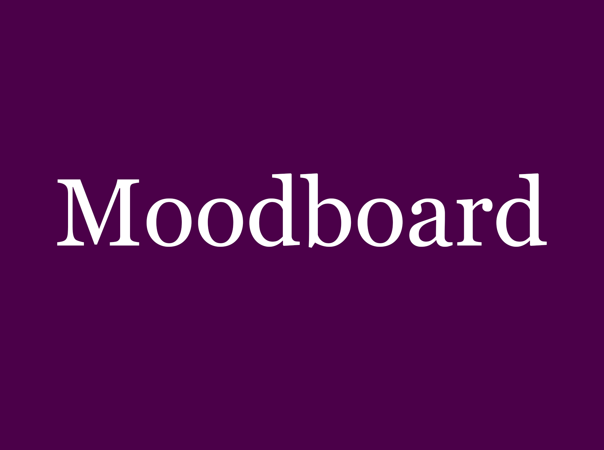

# Moodboards

Add a moodboard for each team member plus a final team moodboard.

*Tutors will download the image to view the full size persona*.

<!-- edit as required -->

## Moodboard One

### Name of team member
Explain how your personal influences and inspirations for this moodboard.

---

## Moodboard Two

### Name of team member
Explain how your personal influences and inspirations for this moodboard.

---

## Moodboard Three

### Name of team member
Explain how your personal influences and inspirations for this moodboard.

---

## Moodboard Four

### Name of team member
Explain how your personal influences and inspirations for this moodboard.

---

## Moodboard Five

### Name of team member
Explain how your personal influences and inspirations for this moodboard.

---

## Team Moodboard

### Name of team member
Explain how you combined your influences and inspirations to create a group vision through this moodboard.

---
